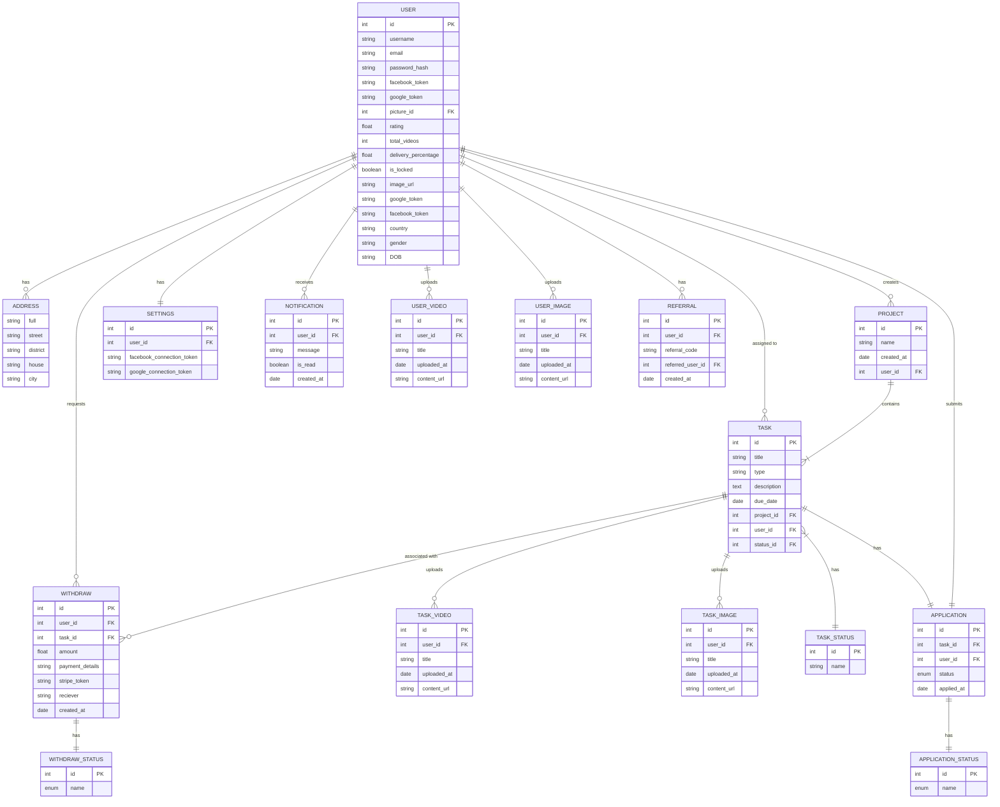

# PostgreSQL Database Relations Diagram (DB Design)

```mermaid
erDiagram
    USER ||--o{ ADDRESS : "has"
    USER ||--o{ PROJECT : "creates"
    USER ||--o{ TASK : "assigned to"
    USER ||--|| SETTINGS : "has"
    USER ||--o{ NOTIFICATION : "receives"
    USER ||--o{ WITHDRAW : "requests"
    WITHDRAW ||--|| WITHDRAW_STATUS : "has"
    USER ||--o{ USER_VIDEO : "uploads"
    USER ||--o{ USER_IMAGE : "uploads"
    TASK ||--o{ TASK_VIDEO : "uploads"
    TASK ||--o{ TASK_IMAGE : "uploads"
    USER ||--o{ REFERRAL : "has"
    PROJECT ||--|{ TASK : "contains"
    TASK }|--|| TASK_STATUS : "has"
    TASK ||--o{ WITHDRAW : "associated with"
    TASK ||--|| APPLICATION : "has"
    APPLICATION ||--|| APPLICATION_STATUS : "has"
    USER ||--|| APPLICATION : "submits"

    USER {
        int id PK
        string username
        string email
        string password_hash
        string facebook_token
        string google_token
        int picture_id FK
        float rating
        int total_videos
        float delivery_percentage
        boolean is_locked
        string image_url
        string google_token
        string facebook_token
        string country
        string gender
        string DOB
    }
    ADDRESS {
        string full
        string street
        string district
        string house
        string city
    }
    SETTINGS {
        int id PK
        int user_id FK
        string facebook_connection_token
        string google_connection_token
    }
    PROJECT {
        int id PK
        string name
        date created_at
        int user_id FK
    }
    TASK {
        int id PK
        string title
        string type
        text description
        date due_date
        int project_id FK
        int user_id FK
        int status_id FK
    }
    TASK_STATUS {
        int id PK
        string name
    }
    NOTIFICATION {
        int id PK
        int user_id FK
        string message
        boolean is_read
        date created_at
    }
    WITHDRAW {
        int id PK
        int user_id FK
        int task_id FK
        float amount
        string payment_details
        string stripe_token
        string reciever
        date created_at
    }
    WITHDRAW_STATUS {
         int id PK
         %% pending, approved, current, paid-out
         enum name
    }
    USER_IMAGE {
        int id PK
        int user_id FK
        string title
        date uploaded_at
        string content_url
    }
    USER_VIDEO {
        int id PK
        int user_id FK
        string title
        date uploaded_at
        string content_url
    }
    TASK_IMAGE {
        int id PK
        int user_id FK
        string title
        date uploaded_at
        string content_url
    }
    TASK_VIDEO {
        int id PK
        int user_id FK
        string title
        date uploaded_at
        string content_url
    }
    REFERRAL {
        int id PK
        int user_id FK
        string referral_code
        int referred_user_id FK
        date created_at
    }
    APPLICATION {
        int id PK
        int task_id FK
        int user_id FK
        enum status
        date applied_at
    }
    APPLICATION_STATUS {
         int id PK
          %% applied, active, archived
         enum name
    }
```
