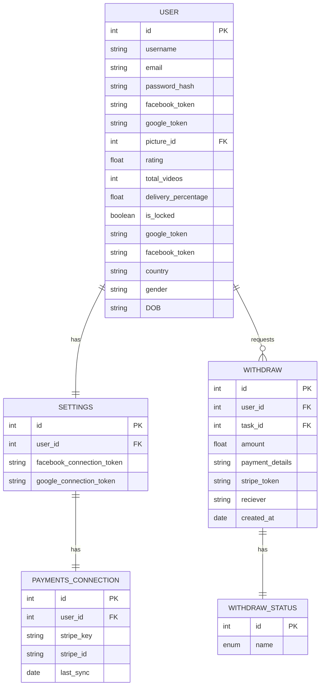

# User (DB Design)

```mermaid
erDiagram

    USER ||--|| SETTINGS : "has"
    SETTINGS ||--|| PAYMENTS_CONNECTION : "has"
    USER ||--o{ WITHDRAW : "requests"
    WITHDRAW ||--|| WITHDRAW_STATUS : "has"

    USER {
        int id PK
        string username
        string email
        string password_hash
        string facebook_token
        string google_token
        int picture_id FK
        float rating
        int total_videos
        float delivery_percentage
        boolean is_locked
        string google_token
        string facebook_token
        string country
        string gender
        string DOB
    }
    SETTINGS {
        int id PK
        int user_id FK
        string facebook_connection_token
        string google_connection_token
    }
    WITHDRAW {
        int id PK
        int user_id FK
        int task_id FK
        float amount
        string payment_details
        string stripe_token
        string reciever
        date created_at
    }
    WITHDRAW_STATUS {
         int id PK
         %% pending, approved, current, paid-out
         enum name
    }
    PAYMENTS_CONNECTION {
        int id PK
        int user_id FK
        string stripe_key
        string stripe_id
        date last_sync
    }

```
