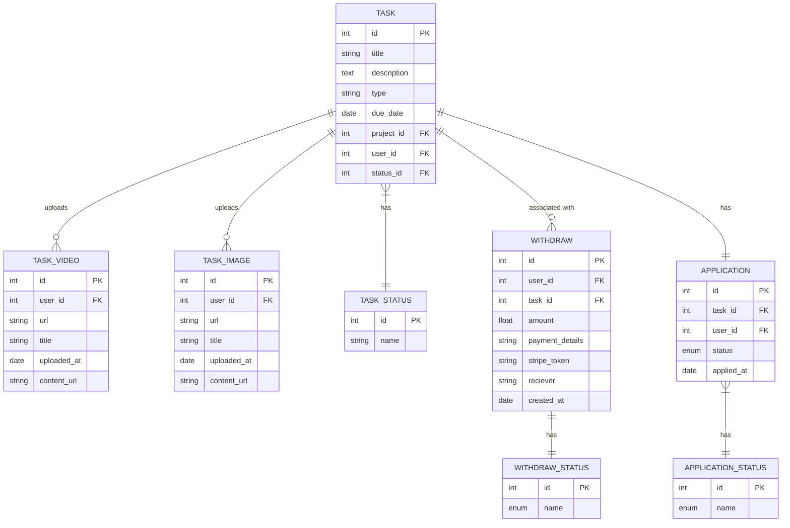

# Task (DB Design)

```mermaid
erDiagram
    TASK ||--o{ TASK_VIDEO : "uploads"
    TASK ||--o{ TASK_IMAGE : "uploads"
    TASK }|--|| TASK_STATUS : "has"
    TASK ||--o{ WITHDRAW : "associated with"
    TASK ||--|| APPLICATION : "has"
    APPLICATION }|--|| APPLICATION_STATUS : "has"
    WITHDRAW ||--|| WITHDRAW_STATUS : "has"


    TASK {
        int id PK
        string title
        text description
        string type
        date due_date
        int project_id FK
        int user_id FK
        int status_id FK
    }
    TASK_STATUS {
        int id PK
        string name
    }
    WITHDRAW {
        int id PK
        int user_id FK
        int task_id FK
        float amount
        string payment_details
        string stripe_token
        string reciever
        date created_at
    }
    WITHDRAW_STATUS {
        int id PK
        %% pending, approved, current, paid-out
        enum name
    }
    TASK_IMAGE {
        int id PK
        int user_id FK
        string url
        string title
        date uploaded_at
        string content_url
    }
    TASK_VIDEO {
        int id PK
        int user_id FK
        string url
        string title
        date uploaded_at
        string content_url
    }
    APPLICATION {
        int id PK
        int task_id FK
        int user_id FK
        enum status
        date applied_at
    }
    APPLICATION_STATUS {
         int id PK
          %% applied, active, archived
         enum name
    }
```
